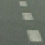
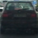
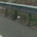
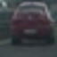
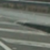
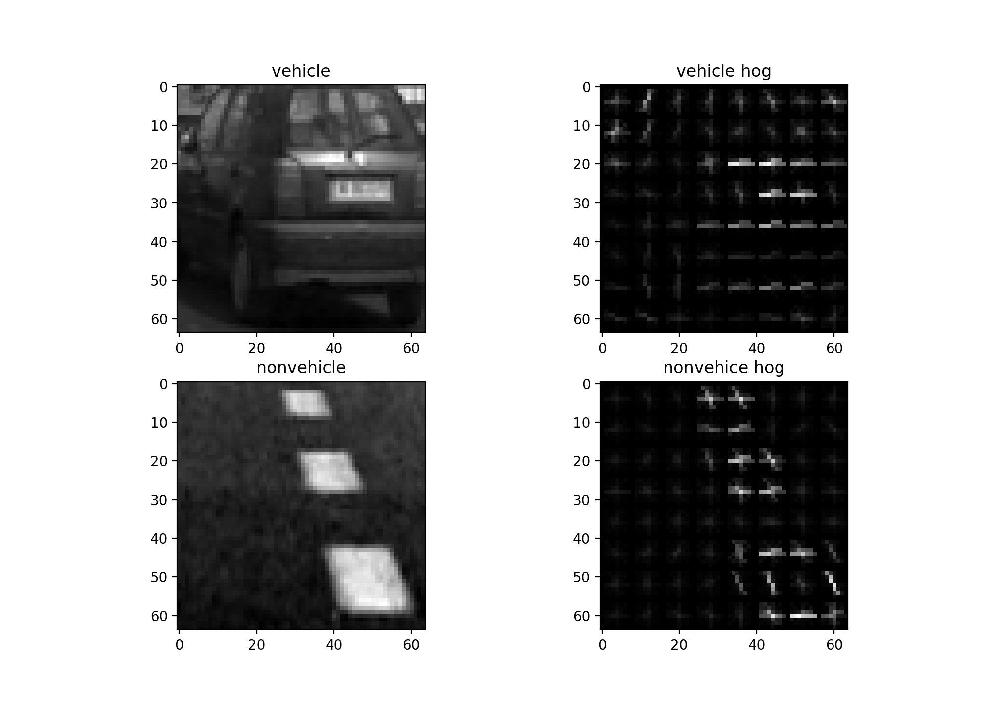
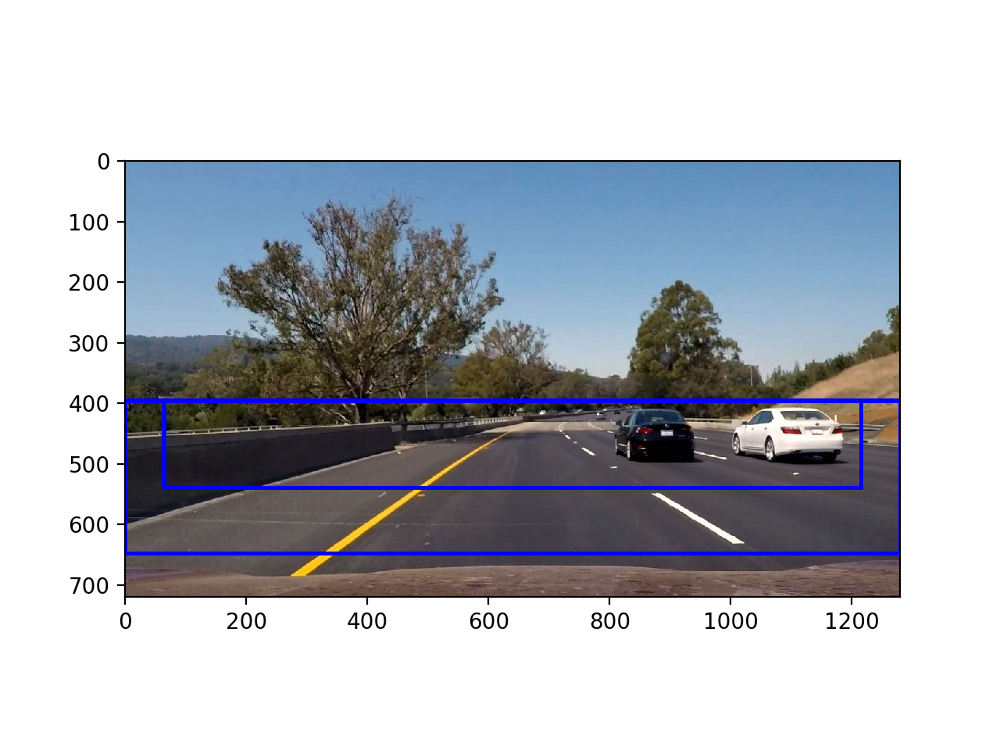
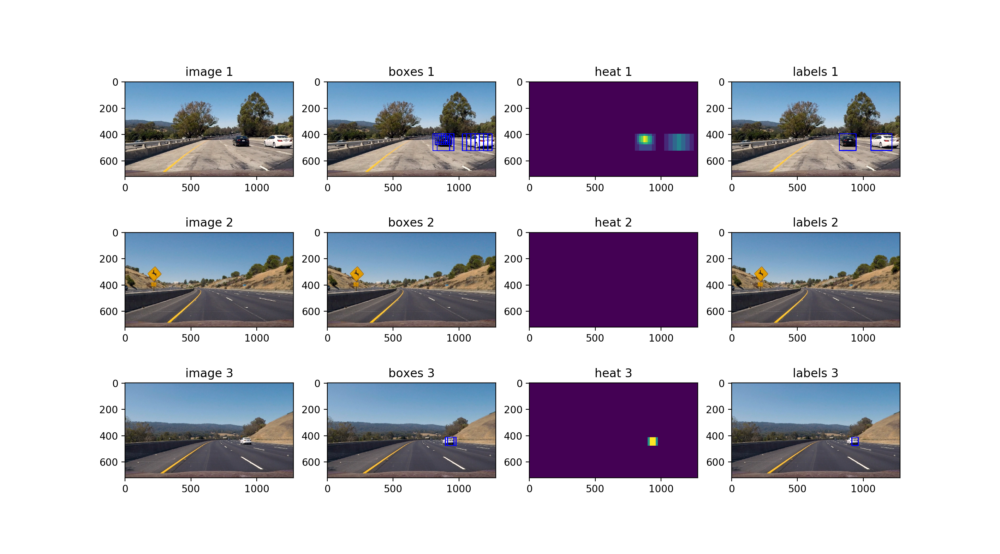
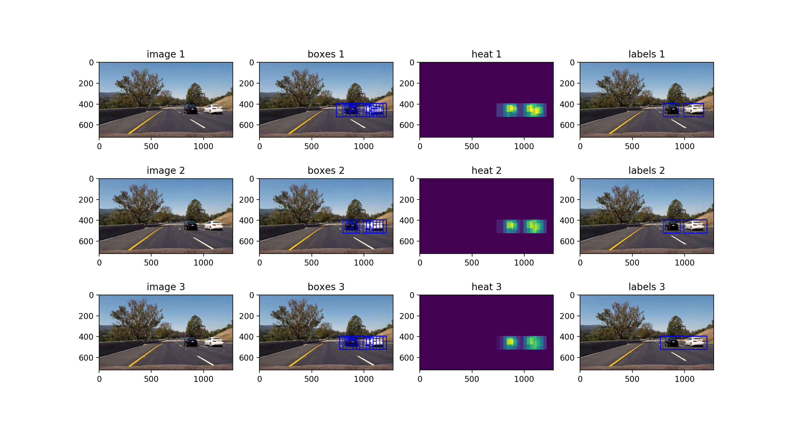

# Vehicle Detection
---

The goals / steps of this project are the following:

* Perform a Histogram of Oriented Gradients (HOG) feature extraction on a labeled training set of images and train a classifier Linear SVM classifier
* Optionally, you can also apply a color transform and append binned color features, as well as histograms of color, to your HOG feature vector. 
* Note: for those first two steps don't forget to normalize your features and randomize a selection for training and testing.
* Implement a sliding-window technique and use your trained classifier to search for vehicles in images.
* Run your pipeline on a video stream and create a heat map of recurring detections frame by frame to reject outliers and follow detected vehicles.
* Estimate a bounding box for vehicles detected.

---
### Writeup / README

#### 1. Provide a Writeup

- [x] You're reading it!

### Histogram of Oriented Gradients (HOG)

#### 1. Explain how (and identify where in your code) you extracted HOG features from the training images.

- [x] The code for HOG, histogram, and binned color features are all located in the [features.py](features.py) file.

I started by reading in all the `vehicle` and `non-vehicle` images.  Here is an example of one of each of the `vehicle` and `non-vehicle` classes:

| Vehicles | Non Vehicles |
| -------- | ------------ |
| |  |
| |  |
| |  |

I explored different color spaces and different `skimage.hog()` parameters (`orientations`, `pixels_per_cell`, and `cells_per_block`).  Experimenting with what values led to the strongest classification accuracy.  In working with the tunings I found similar classification accuracy between `HSV` and `YCrCb` and initially settled on `HSV`.  Subsequent testing with video images led me to reconsider that choice as it seemed that the `YCrCb` model seemed to generalize better to the new images.

Here is an example using the `YCrCb` color space and HOG parameters of `orientations=12`, `pixels_per_cell=(8, 8)` and `cells_per_block=(2, 2)`:

#### 2. Explain how you settled on your final choice of HOG parameters.

I tried various combinations of parameters and performed 5 fold cross validation on 
different permutations examining the mean classification accuracy to determine which set
of parameters led to the best classification score.

In hindsight it may have been better to choose a simpler set of features that would lead
to faster feature extraction.  The parameters chosen were acceptable for training the 
model, but in scoring the model on the final video it took more time than would be practical
for an online realtime scoring for practical use.

#### 3. Describe how (and identify where in your code) you trained a classifier using your selected HOG features (and color features if you used them).

The main function in `features.py` includes the core model classifier trained using a linear SVM model as specified in the project criteria.  The model was trained by extracting and normalizing features, splitting into a training and test set, fitting the linear svm model, validating the model on the test set, and then pickling the model with the rest of the model parameter state for subsequent use in the remainder of the project.

### Sliding Window Search

#### 1. Describe how (and identify where in your code) you implemented a sliding window search.  How did you decide what scales to search and how much to overlap windows?

The sliding window search can be found in the [windows.py](windows.py) file.

For the sliding window I implemented a search at two scales, a larger scale covering most of the bottom half of the image and a smaller one roughly covering 1/4 of the image around the bottom middle.  These scales and locations were chosen based on expected sizes of vehicles within the region of interest.

The following image demonstrates the locations of the search windows.

#### 2. Show some examples of test images to demonstrate how your pipeline is working.  What did you do to optimize the performance of your classifier?

Ultimately I searched on two scales using YCrCb 3-channel HOG features plus spatially binned color and histograms of color in the feature vector.  In analyzing classifier performance the HOG features provided the most benefit, but the binned color and histograms of color are fast to calculate and provide a modest complement to the HOG features.  Here are a few example images.

---

### Video Implementation

#### 1. Provide a link to your final video output.  Your pipeline should perform reasonably well on the entire project video (somewhat wobbly or unstable bounding boxes are ok as long as you are identifying the vehicles most of the time with minimal false positives.)

Here's a [link to my video result](./output.mp4)

#### 2. Describe how (and identify where in your code) you implemented some kind of filter for false positives and some method for combining overlapping bounding boxes.

I recorded the positions of positive detections in each frame of the video.  From the positive detections I created a heatmap and then thresholded that map to identify vehicle positions.  I then used `scipy.ndimage.measurements.label()` to identify individual blobs in the heatmap.  I then assumed each blob corresponded to a vehicle.  I constructed bounding boxes to cover the area of each blob detected.  

Here's an example result showing the heatmap from a series of frames of video, the result of `scipy.ndimage.measurements.label()` and the bounding boxes then overlaid on the last frame of video:

---

### Discussion

#### 1. Briefly discuss any problems / issues you faced in your implementation of this project.  Where will your pipeline likely fail?  What could you do to make it more robust?

* Classification accuracy during initial training proved difficult to determine well from the initial test data because many of the images were extracted from video frames and there were many pictures of the same vehicle.  This made a random shuffling of the data provided a biased view of the accuracy of the classifier.  This was readily apparent when then applying the classifier to new video frames where misclassifications were more common than classifier verification would have led you to believe.

* Having chosen a model for maximum classification accuracy the time to extract hog features and perform predictions is longer than would be desirable, leading to it being impractical for realtime use and inconvenient for producing the output video.  There is subsequent work that could be done to reduce the feature space and improve the speed of processing additional frames.

* Based on the heatmap methodology it is difficult to distinguish one large car from two overlapping cars.

* The current set of search windows is focused more on proximate vehicles, vehicles further down the road may not be detected well.

